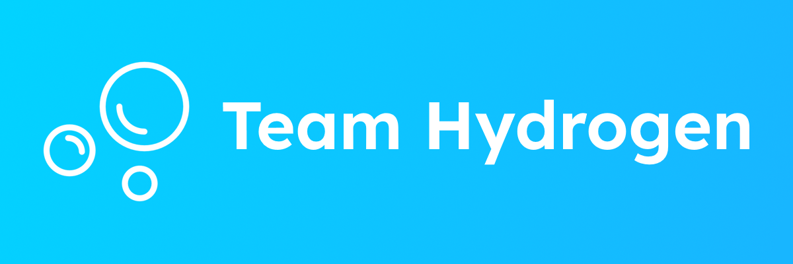

# Welcome to Team Hydrogen! 🫧

---

Team Hydrogen is an innovative, remote game studio focused on creating immersive multiplayer experiences and the tools that power them. 

The passionate duo behind Team Hydrogen are dedicated in building the tools today needs for tomorrow's future.

## ❓ Who are we?

We are a lean, agile studio where we build tools to make games great. 
We want to refine our core technology stack and our flagship framework [Hydrogen](https://github.com/teamhydrogen/hydrogen)

## 👀 Our vision

We believe that all developers should have free access to industry-level tooling for their needs.

That's why we're making our suite of tools:

- [🫧 Hydrogen](https://github.com/teamhydrogen/hydrogen)
- 🖌️ Chroma (TO BE RELEASED)

We try and make the development experience fun and quick, so you can work fast and not get dragged down by the repetitiveness of boilerplate.

## 💖 Our core values

- Technical Excellence: Quality is of the utmost importance, and user satisfaction is our top priority.

- Sustainability: Making games shouldn't be boring.

- Continuous Learning: Nobody is perfect and there's always more to learn.
---
*Excited? Follow us on [GitHub](https://github.com/teamhydrogen) as we define the future of development.*